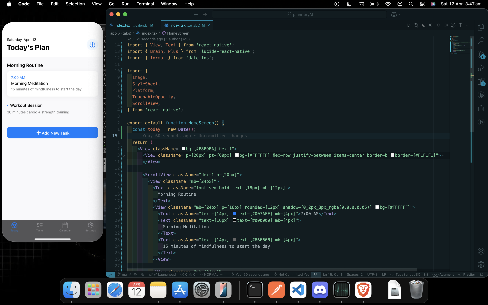

<div align="center">
  <h1>PlanneryAI 📱</h1>
  <p>Your AI-powered daily planner and task management companion</p>


[](https://expo.dev/)
[](https://www.typescriptlang.org/)

</div>

<p align="center">
  
</p>

## 🚧 Development Status

**Note: PlanneryAI is currently under active development.** Features and functionality are being added and refined. The app is not yet ready for production use.

## 🌟 Features (Planned)

- 🤖 AI-powered task suggestions and scheduling
- 📅 Smart calendar integration
- ✅ Intuitive task management
- 🎯 Goal tracking and progress monitoring
- 🌙 Dark/Light mode support
- 📱 Cross-platform (iOS & Android)

## 🛠️ Tech Stack

- [Expo](https://expo.dev/) - React Native development framework
- [TypeScript](https://www.typescriptlang.org/) - Type-safe JavaScript
- [NativeWind](https://www.nativewind.dev/) - Tailwind CSS for React Native
- [Expo Router](https://docs.expo.dev/router/introduction/) - File-based routing
- [React Native Reanimated](https://docs.swmansion.com/react-native-reanimated/) - Animations

## 🚀 Getting Started

1. **Install dependencies**

```bash
npm install
```

2. **Start the development server**

```bash
npx expo start
```

3. **Run on your device**
   - Scan the QR code with Expo Go ([iOS](https://apps.apple.com/app/apple-store/id982107779) | [Android](https://play.google.com/store/apps/details?id=host.exp.exponent))
   - Or press 'i' for iOS simulator
   - Or press 'a' for Android emulator

## 📱 Development Builds

To create a development build:

```bash
npx expo prebuild
```

## 🤝 Contributing

As this project is still in development, we're not accepting contributions at this time. Stay tuned for updates!

## 📝 License

This project is private and under development. All rights reserved.

## 📞 Contact

For inquiries about PlanneryAI, please reach out to [Your Contact Information].
